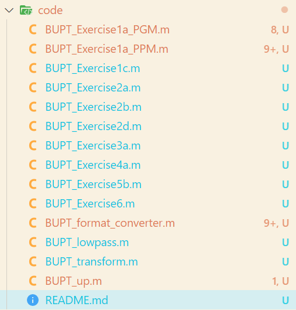
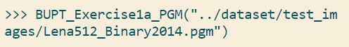
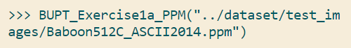
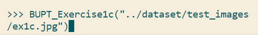
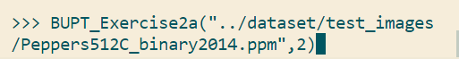
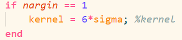
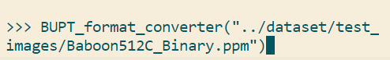

# ImageVideoProcessCoursework
# @author magixx(Yuwei Min)

**Learning purposes**
### ./result

>This is ./result folder.

>The result folder is used to store images generated by the program.

####Folder structure:
- ./output
	- exercise1a
  
	- exercise1b
  
	- exercise1c
  
  - exercise2a
  
  - exercise2c
  
  - exercise2d
  
  - exercise3a
  
  - exercise3b
  
  - exercise4a
  
  - exercise4b
  
  - exercise5a
  
  - exercise5b
  
  - exercise6
  

The folder name corresponds to the corresponding exercise.

> **You can view the image from the result folder or report.**

---
### ./code

>This is ./code folder.

>The code folder is used to store matlab function.

#### Folder structure:
- ./code
	

Function names are related to corresponding exercises.
>***Especially***, the naming of the following functions is mandatory in exercise.
>- BUPT_format_converter.m is related to **exercise 1b**. 
>- BUPT_lowpass.m is related to **exercise 5a**.
>- BUPT_transform.m is related to **exercise 3b**.
>- BUPT_up.m is related to **exercise 4b**.

---
#### Run method
- `BUPT_Exercise1a_PGM(path)`
  
- `BUPT_Exercise1a_PPM(path)`
  
- `BUPT_Exercise1c(path)`
  
- `BUPT_Exercise2a(path,quan_factor)`
  
- `BUPT_Exercise2b(path)`
  
- `BUPT_Exercise2d()`
  
- `BUPT_Exercise3a()`
  
- `BUPT_Exercise4a(noise_type, sigma)`
  
- `BUPT_Exercise5b(op)`
  
  
- `BUPT_Exercise6( sigma, kernel )`
  
  
- `BUPT_format_converter(path)`
  
- `BUPT_lowpass(sigma)`
  
- `BUPT_transform( rotate,skew,flag )`
  
- `BUPT_up( type, factor )`
  
