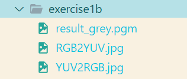
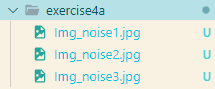
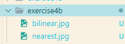

# ImageVideoProcessCoursework
## @author magixx(Yuwei Min)

### ./result

>This is ./result folder.

>The result folder is used to store images generated by the program.

####Folder structure:
- ./output
	- exercise1a
  
	- exercise1b
  
	- exercise1c
  
  - exercise2a
  
  - exercise2c
  
  - exercise2d
  
  - exercise3a
  
  - exercise3b
  
  - exercise4a
  
  - exercise4b
  
  - exercise5a
  
  - exercise5b
  
  - exercise6
  

The folder name corresponds to the corresponding exercise.

> **You can view the image from the result folder or report.**